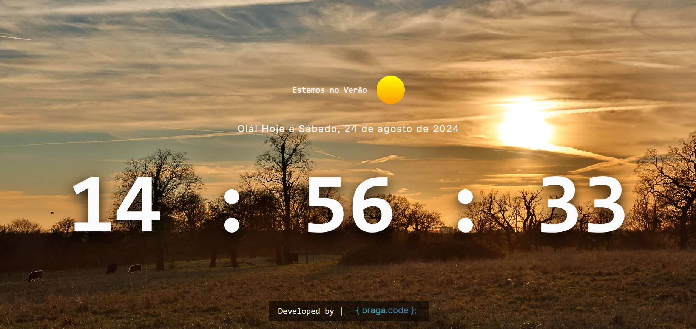

# ⏱️ Basic Web Clock



Esse projeto trata-se de um relógio web com informações adicionais da data completa atual e da estação atual.

## 📌 Começando

Para ter acesso a esse projeto, faça os seguintes passos:

### **1. Pré-requisitos:**

- **IDE:** Garanta que tenha uma IDE instalada na sua máquina (por exemplo, Visual Studio Code).

- **Extensão para Servidor Local:** Instale uma extensão na sua IDE que permita iniciar um servidor local para visualizar o projeto (como Live Server).

- **Node.js e npm:** Certifique-se de que o Node.js e o npm estão instalados na sua máquina.

### **2. Instalando:**

Clone o repositório em sua máquina local:

```bash
git clone https://github.com/seu-usuario/seu-repositorio.git
```

#### **1. Instalando as dependências:**

Para instalar as dependências, faça o seguinte comando:

```bash
npm i
```

### **3. Executando o projeto:**

#### **1. Compilar TypeScript:**

Para compilar os arquivos TypeScript, execute o seguinte comando:

```bash
npm run build
```

#### **2. Iniciar Servidor Local:**

Se você estiver usando uma extensão como o Live Server no Visual Studio Code, você pode iniciar o servidor diretamente pela interface da IDE. Alternativamente, use o comando:

```bash
npx live-server
```

Isso abrirá o projeto no seu navegador padrão, permitindo que você interaja com a calculadora. Ou se quiser ver somente o funcional, eu hospedei o projeto no GitHub Pages: (link do githubpages)

## 🧑🏻‍💻Tecnologias utilizadas:
<div style="flex-basis: 48%;">


  
</div>
## 🔄️ Melhorias Futuras:

Planejo adicionar as seguintes funcionalidades:

- Adicionar horários de outras regiões/países, dando opção de escolha ao usuário.
- .

## 📝 Licença:

Este projeto está licenciado sob a licença MIT.

## 🧑🏻‍💻 Autor:

- **Leonardo Braga** - [](https://github.com/code-front-braga)
